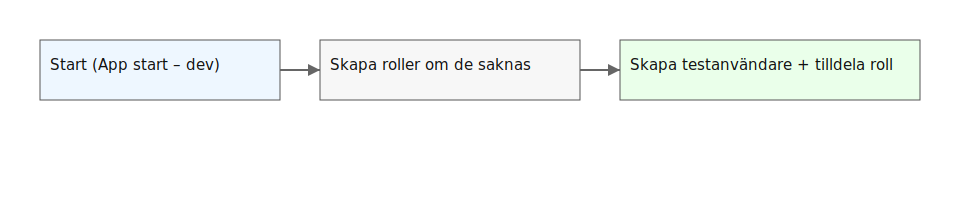

# Seeding av roller & användare

[◀ Översikt](./02-00-overview.md) | [Nästa: Inloggning & token ▶](./02-20-login-and-token.md)

## Varför seeding?
Utan seeding startar din applikation helt tom. Genom att koda in seeding sparar du tid:
- **Konsekvens:** Du vet att "admin@test.com" alltid har lösenordet "Pass123!".
- **Idempotens (Viktigt!):** En bra seeding-funktion kollar först: *"Finns rollen Admin redan?"*. Om ja -> gör inget. Om nej -> skapa. Detta gör att vi kan starta om appen 100 gånger utan att krascha på "Duplicate Key"-fel.

## Processen i koden
1. **Roles:** Skapa de hinkar som användare kan ligga i (Admin, Lärare).
2. **Users:** Skapa själva användarkontona.
3. **Assignment:** Koppla ihop användare med rätt hink.

> **Pro-tip:** I `Program.cs` kör vi seeding direkt efter `app.Build()`. Det garanterar att datan finns där innan första användaren hinner blinka.

---
[◀ Översikt](./02-00-overview.md) | [Nästa: Inloggning & token ▶](./02-20-login-and-token.md)