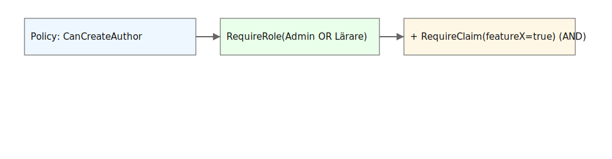

# Policy‑design: Roller vs Claims

[◀ Föregående: Översikt](./03-00-overview.md) | [Nästa: Custom requirements ▶](./03-20-custom-requirements.md)

---

## Detaljstyra behörighet
Istället för att strössla `[Authorize(Roles = "Admin")]` överallt, bygger vi namngivna policies. 

### Logiken bakom kulisserna
- **OR (Minst ett krav):** `RequireRole("Admin", "Teacher")` betyder att det räcker med en av rollerna.
- **AND (Alla krav):** Varje ny rad i din policy-builder lägger till ett krav. `RequireRole("Admin")` + `RequireClaim("Badge", "Gold")` betyder att användaren måste ha BÅDA.

### Default vs Fallback
- **DefaultPolicy:** Vad som händer när du bara skriver `[Authorize]`.
- **FallbackPolicy:** En global säkerhetsinställning. Om den är satt, krävs auktorisering på *alla* endpoints som inte har `[AllowAnonymous]`.

---

[◀ Föregående: Översikt](./03-00-overview.md) | [Nästa: Custom requirements ▶](./03-20-custom-requirements.md)