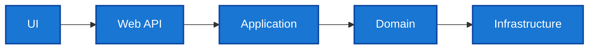
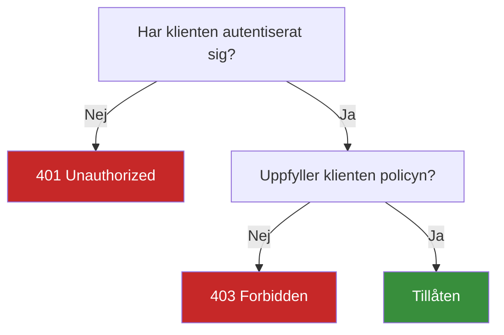

# AuthN vs AuthZ – översikt

**AuthN (Authentication)** svarar på *vem* användaren är. **AuthZ (Authorization)** svarar på *vad* användaren får göra.

## Kedjan UI → API → App → Domain → Infra

## Beslutsplacering
- **AuthN**: sker vid **API**-gränsen (middleware/handler).
- **AuthZ**: uttrycks som **policies** på endpoints/kontrollers.

## 401 vs 403

