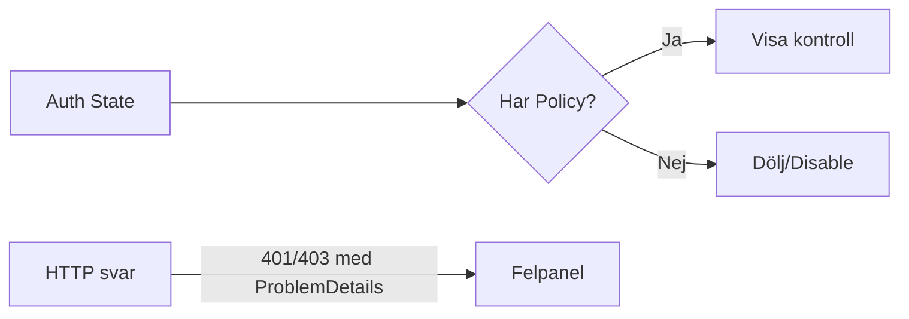

# UI-reaktioner på auth-fel

## Mönster
- **Visa/Dölj**: Rendera inte skyddade knappar/länkar för saknade behörigheter.
- **Disable**: Visa kontroller men disable vid saknad behörighet.
- **Felpanel**: Visa ProblemDetails vid 401/403.

