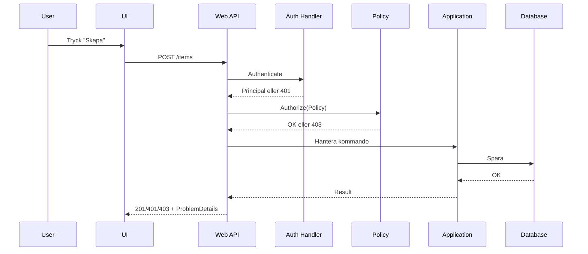

# Egen auth-kedja

[◀ Föregående](./1-policy-matrix.md) | [Nästa ▶](./3-tasks.md)

---

```mermaid
sequenceDiagram
  participant U as User
  participant UI as UI
  participant API as Web API
  participant AUTH as Auth Handler
  participant POL as Policy
  participant APP as Application
  participant DB as Database

  U->>UI: Tryck "Skapa"
  UI->>API: POST /items
  API->>AUTH: Authenticate
  AUTH-->>API: Principal eller 401
  API->>POL: Authorize(Policy)
  POL-->>API: OK eller 403
  API->>APP: Hantera kommando
  APP->>DB: Spara
  DB-->>APP: OK
  APP-->>API: Result
  API-->>UI: 201/401/403 + ProblemDetails
```

---

[◀ Föregående](./1-policy-matrix.md) | [Nästa ▶](./3-tasks.md)
