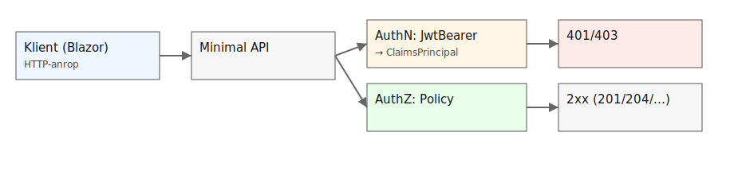

# Auth‑pipeline – Från HTTP till beslut

[◀ Föregående: Boardingkortet](./ca-1-25-the-boarding-pass.md) | [Nästa: Policies & UI ▶](./ca-1-40-policies-and-ui.md)

I ASP.NET Core hanteras säkerhet som ett löpande band (Middleware). Ordningen är kritisk.

## Flödet i Program.cs
1.  **Request kommer in.**
2.  `UseAuthentication()`: Tittar i HTTP-headern efter `Authorization: Bearer <token>`. Om den finns, packas den upp och användaren skapas i koden (`ClaimsPrincipal`).
3.  `UseAuthorization()`: Tittar på den skapade användaren och kollar: "Har den här personen de roller som krävs för denna endpoint?".
4.  **Endpoint anropas:** Om båda ovan godkänts körs din kod.

---
[◀ Föregående: Boardingkortet](./ca-1-25-the-boarding-pass.md) | [Nästa: Policies & UI ▶](./ca-1-40-policies-and-ui.md)